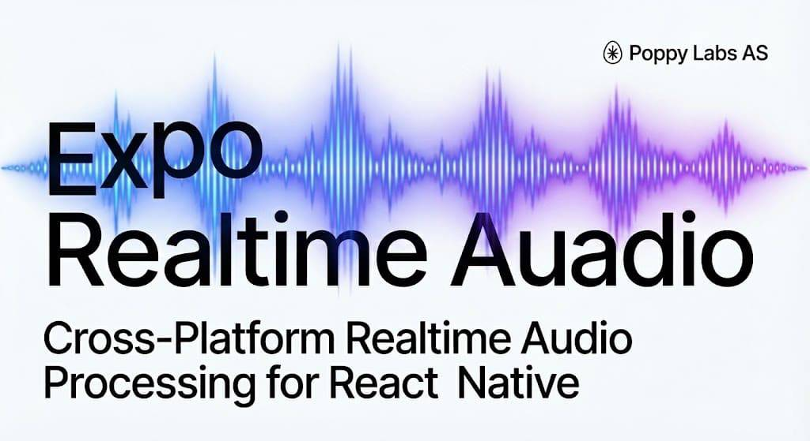

# expo-realtime-audio

Real-time bidirectional audio streaming for Expo and React Native. Record microphone input and play audio chunks with ultra-low latency using native `AVAudioEngine`.

Built for voice AI applications, live audio processing, and real-time communication.

## Features

- **Real-time streaming** - Get audio chunks as they're recorded, not after
- **Bidirectional** - Record and play simultaneously with proper audio session handling
- **Low latency** - Native `AVAudioEngine` with configurable buffer intervals (default 50ms)
- **Automatic resampling** - Hardware sample rate → target sample rate conversion handled natively
- **Simple React hook** - `useAudioStream()` manages all the complexity
- **TypeScript first** - Full type definitions included
- **Expo SDK 54+** - Built with the modern Expo Modules API

## Platform Support

| Platform | Status |
|----------|--------|
| iOS      | Supported |
| Android  | Coming soon |

## Installation

```bash
npx expo install expo-realtime-audio
```

Or with npm/yarn:

```bash
npm install expo-realtime-audio
# or
yarn add expo-realtime-audio
```

### iOS Setup

Add microphone permission to your `app.json`:

```json
{
  "expo": {
    "ios": {
      "infoPlist": {
        "NSMicrophoneUsageDescription": "This app needs microphone access for audio recording"
      }
    }
  }
}
```

Then rebuild your app:

```bash
npx expo prebuild
npx expo run:ios
```

## Quick Start

```tsx
import { useAudioStream } from 'expo-realtime-audio';

function VoiceRecorder() {
  const {
    isRecording,
    requestPermissions,
    startRecording,
    stopRecording,
  } = useAudioStream();

  const handleStart = async () => {
    const { granted } = await requestPermissions();
    if (!granted) return;

    await startRecording(
      { sampleRate: 16000, channels: 1, intervalMs: 50 },
      (chunk) => {
        // chunk.data is base64-encoded PCM16 audio
        console.log(`Received ${chunk.chunkSize} bytes at ${chunk.position}ms`);

        // Send to your voice AI, WebSocket, etc.
        sendToServer(chunk.data);
      }
    );
  };

  return (
    <Button
      title={isRecording ? 'Stop' : 'Record'}
      onPress={isRecording ? stopRecording : handleStart}
    />
  );
}
```

## API Reference

### `useAudioStream(options?)`

The main hook for audio streaming.

```tsx
const {
  isRecording,      // boolean - recording state
  isPlaying,        // boolean - playback state
  prepare,          // () => Promise<void> - pre-initialize audio session
  requestPermissions, // () => Promise<PermissionResult>
  startRecording,   // (config, onChunk) => Promise<RecordingResult>
  stopRecording,    // () => Promise<void>
  startPlayback,    // (config, onComplete?) => Promise<void>
  playChunk,        // (base64Data) => Promise<void>
  endPlayback,      // () => Promise<void> - signal end, wait for drain
  stopPlayback,     // () => Promise<void> - stop immediately
} = useAudioStream({
  onError: (error) => console.error(error.code, error.message),
});
```

### Recording

#### `startRecording(config, onAudioChunk)`

Start capturing audio from the microphone.

```tsx
const result = await startRecording(
  {
    sampleRate: 16000,  // Target sample rate (default: 16000)
    channels: 1,        // Mono or stereo (default: 1)
    intervalMs: 50,     // Chunk emission interval (default: 50)
    bufferSize: 1024,   // Buffer size: 256 | 512 | 1024 | 2048 (default: 1024)
    audioSession: {     // iOS audio session options
      allowBluetooth: true,   // Route through Bluetooth (default: true)
      mixWithOthers: true,    // Mix with other apps (default: true)
      defaultToSpeaker: true, // Use speaker not earpiece (default: true)
    },
  },
  (chunk) => {
    // Called every ~intervalMs with audio data
    chunk.data;       // string - base64-encoded PCM16
    chunk.position;   // number - milliseconds since start
    chunk.chunkSize;  // number - bytes in this chunk
    chunk.totalSize;  // number - total bytes recorded
  }
);

// result contains actual recording parameters
result.sampleRate;  // number
result.channels;    // number
result.bitDepth;    // number (always 16)
result.mimeType;    // string (always "audio/pcm")
```

#### `stopRecording()`

Stop recording and clean up.

```tsx
await stopRecording();
```

### Playback

For streaming audio playback (e.g., TTS responses):

#### `startPlayback(config, onComplete?)`

Initialize playback engine.

```tsx
await startPlayback(
  {
    sampleRate: 24000,  // Expected sample rate (default: 24000)
    channels: 1,        // Mono or stereo (default: 1)
  },
  () => {
    console.log('Playback finished');
  }
);
```

#### `playChunk(base64Data)`

Queue audio data for playback.

```tsx
// Feed chunks as they arrive from your audio source
await playChunk(base64AudioData);
```

#### `endPlayback()`

Signal that all chunks have been sent. Playback continues until the buffer drains, then `onPlaybackComplete` fires.

```tsx
await endPlayback();
```

#### `stopPlayback()`

Stop playback immediately, discarding any buffered audio.

```tsx
await stopPlayback();
```

### Permissions

#### `requestPermissions()`

Request microphone access. Also calls `prepare()` on success.

```tsx
const { granted, status } = await requestPermissions();
// status: "granted" | "denied" | "undetermined"
```

### Error Handling

Pass an `onError` callback to handle native errors:

```tsx
const stream = useAudioStream({
  onError: (error) => {
    console.error(`[${error.code}] ${error.message}`);
    // Common codes: ALREADY_RECORDING, START_ERROR, PREPARE_ERROR
  },
});
```

## Audio Format

All audio data is:
- **Encoding**: Linear PCM, 16-bit signed integers, little-endian
- **Transport**: Base64-encoded strings
- **Channels**: Interleaved if stereo

To decode in JavaScript:

```tsx
function decodeBase64ToPCM16(base64: string): Int16Array {
  const binary = atob(base64);
  const bytes = new Uint8Array(binary.length);
  for (let i = 0; i < binary.length; i++) {
    bytes[i] = binary.charCodeAt(i);
  }
  return new Int16Array(bytes.buffer);
}
```

## Technical Details

### iOS Implementation

- Uses `AVAudioEngine` for low-latency audio I/O
- Audio session configured as `.playAndRecord` with `.voiceChat` mode
- Automatic sample rate conversion via `AVAudioConverter`
- Configurable Bluetooth, speaker routing, and audio mixing options
- Recording runs on a dedicated high-priority queue

### Performance

- Default 50ms chunk interval balances latency vs. overhead
- Native resampling is more efficient than JavaScript alternatives
- Configurable buffer sizes (256, 512, 1024, 2048 frames) - smaller = lower latency, larger = more stable

## Requirements

- Expo SDK 54 or later
- React Native 0.76 or later
- iOS 13.4 or later

## Contributing

Contributions are welcome! Please open an issue first to discuss what you'd like to change.

## License

MIT - see [LICENSE](./LICENSE) for details.

---

Built with care by [Poppy](https://askpoppy.ai)
